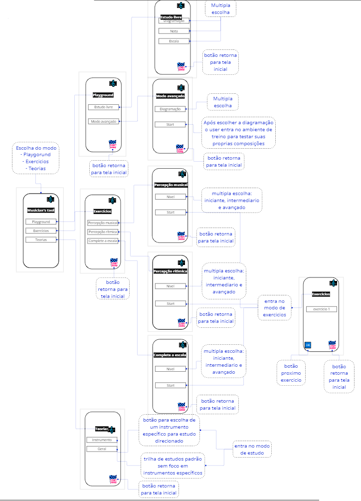

# Projeto de Interface

Para elaboração do projeto de interface, foram observados os requisitos exigidos para o sistema, com o foco em usabilidade e acessibilidade e responsividade para todas as telas, com o intuito de funcionar em desktops e dispositivos móveis.

## User Flow

Os diagramas nas figuras abaixo apresentam o fluxo de usuário, onde é possível observar as ações possíveis e estruturação das páginas. Os layouts apresentados são em ambiente desktop através do acesso via navegador de internet e também por meio de dispositivos móveis. A visualização do fluxo de usuário está disponível através do projeto na ferramenta Miro.
 

Link miro:
https://miro.com/app/board/uXjVMOLyiIw=/?share_link_id=559641622221

> **Links Úteis**:
> - [User Flow: O Quê É e Como Fazer?](https://medium.com/7bits/fluxo-de-usu%C3%A1rio-user-flow-o-que-%C3%A9-como-fazer-79d965872534)
> - [User Flow vs Site Maps](http://designr.com.br/sitemap-e-user-flow-quais-as-diferencas-e-quando-usar-cada-um/)
> - [Top 25 User Flow Tools & Templates for Smooth](https://www.mockplus.com/blog/post/user-flow-tools)

## Wireframes

Conforme fluxo de telas do projeto, apresentado no item anterior, as telas do sistema são apresentadas em detalhes nos itens que se seguem. As telas do sistema apresentam uma estrutura comum que é apresentada na figura abaixo. Nesta estrutura, existem 2 grandes blocos, descritos a seguir.
 
São eles:
* Cabeçalho - local onde são dispostos elementos fixos de identidade (logo) e navegação principal do site (menu da aplicação);
* Conteúdo - apresenta o conteúdo da tela em questão.

### Tela inicial
 

A tela de home-page apresenta ao usuário três possíveis opções de prosseguimento no site, a partir de três botões clicáveis que o direcionam para as respectivas páginas. 
 

Com base na estrutura padrão, o bloco de conteúdo traz as opções (playground, exercícios e teorias):

* O componente “Playground” consiste em uma área onde o usuário poderá indicar notas e escalas para que o app altere o tom em um só clique. 
* O componente “Exercícios” apresenta alguns exercícios projetados para que o usuário agregue informações úteis ao seu rol de conhecimentos acerca da Musicologia.
* O  componente “Teorias” apresenta aspectos técnicos acerca da teoria musical.

### Tela playground
 

A tela de playground apresenta, no bloco de conteúdo, dois botões clicáveis, que direcionam para as respectivas páginas “Modo Livre” e “Modo Avançado”. O Bloco de cabeçalho apresenta os elementos fixos de identidade (logo) e navegação principal do site (menu da aplicação).

    
### Tela exercícios
 

A tela de exercícios apresenta no bloco de conteúdo, opções possíveis de prosseguimento no site, a partir de botões que o direcionam para páginas que contêm exercícios de aprendizagem. Cada opção direciona o usuário para um exercício.

### Tela teoria
 
    
A tela teoria apresenta uma trilha de estudos que oferece uma sequência de conteúdos organizados de forma didática. Nesta tela, em seu bloco de conteúdo o usuário possui à sua disposição opções de botões clicáveis que apresentam listas instrucionais de aprendizado com artigos.

    
    
> **Links Úteis**:
> - [Protótipos vs Wireframes](https://www.nngroup.com/videos/prototypes-vs-wireframes-ux-projects/)
> - [Ferramentas de Wireframes](https://rockcontent.com/blog/wireframes/)
> - [MarvelApp](https://marvelapp.com/developers/documentation/tutorials/)
> - [Figma](https://www.figma.com/)
> - [Adobe XD](https://www.adobe.com/br/products/xd.html#scroll)
> - [Axure](https://www.axure.com/edu) (Licença Educacional)
> - [InvisionApp](https://www.invisionapp.com/) (Licença Educacional)
