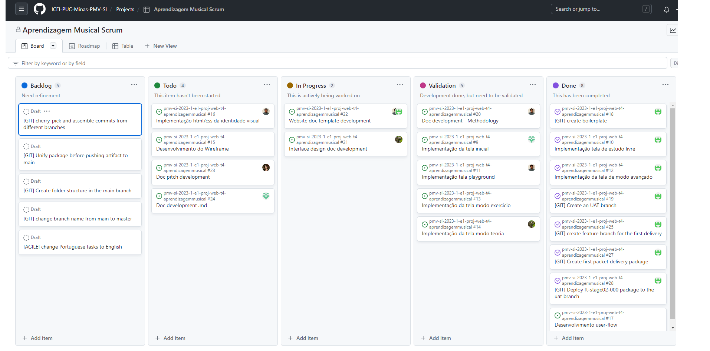

## 3. Metodologia  
 

A metodologia contempla as definições do ferramental utilizado pela equipe, tanto para a manutenção dos códigos e demais artefatos, quanto para a organização do time na execução das tarefas do projeto.
Relação de Ambientes de Trabalho
Os artefatos do projeto são desenvolvidos a partir de diversas plataformas. A relação dos ambientes com seus respectivos propósitos é apresentada na tabela que se segue. 
 

## 3.1. Relação de Ambientes de Trabalho 
 

Os artefatos do projeto são desenvolvidos a partir de diversas plataformas. A relação dos ambientes com seus respectivos propósitos é apresentada na tabela que se segue. 

| Ambiente  | Plataforma | Link de acesso|
| ------------- |-------------|-------------|
| Repositório de código fonte | GitHub | https://github.com/ICEI-PUC-Minas-PMV-SI/pmv-si-2023-1-e1-proj-web-t4-aprendizagemmusical 
| Documentos do projeto | Google Drive | https://docs.google.com/folder/d/1xE9t6zD78VnVkeOSgDfss33QWe85ogqYpx9x-tuG24 
| Projeto de Interface e  Wireframes | Miro |https://miro.com/app/board/uXjVMOLyiIw=/ 
|Gerenciamento do Projeto | GitHub Project | https://github.com/orgs/ICEI-PUC-Minas-PMV-SI/projects/87/views/1 

 

## 3.2. Gerenciamento do Projeto 
 

A equipe utiliza metodologias ágeis, tendo escolhido o Scrum como base para definição do processo de desenvolvimento.

A equipe está organizada de maneira hierárquica linear, onde cada membro é designado para tarefas de acordo com sua afinidade/aptidão técnica, e é composta por :

* Nathália Lopes Soares Bispo
* Marília Rocha de Andrade
* Daniel Felipe Maciel Fernandes
* Luiz Henrique Santos de Andrade
* Matheus Carlos Fraga dos Santos
 

Para organização e distribuição das tarefas do projeto, a equipe está utilizando o xxxxx GitHub Project estruturado com as seguintes listas: 

* Backlog: recebe as tarefas a serem trabalhadas e representa o Product Backlog. Todas as atividades identificadas no decorrer do projeto também devem ser incorporadas a esta lista.
* To Do: Esta lista representa o Sprint Backlog. Este é o Sprint atual que estamos trabalhando.
* In Progress: Quando uma tarefa tiver sido iniciada, ela é movida para cá.
* Validation: Essa lista recebe as tarefas que já estão prontas individualmente, porém aguardam a validação/controle de qualidade dos outros integrantes do grupo
Done: nesta lista são colocadas as tarefas que passaram pelos testes e controle de qualidade e estão prontos para serem entregues ao usuário. Não há mais edições ou revisões necessárias, ele está agendado e pronto para a ação.
 

O quadro kanban do grupo desenvolvido na ferramenta de gerenciamento de projetos está disponível através da URL:

https://github.com/orgs/ICEI-PUC-Minas-PMV-SI/projects/87/views/1

E é apresentado, no estado atual, na Figura abaixo. 
**** 