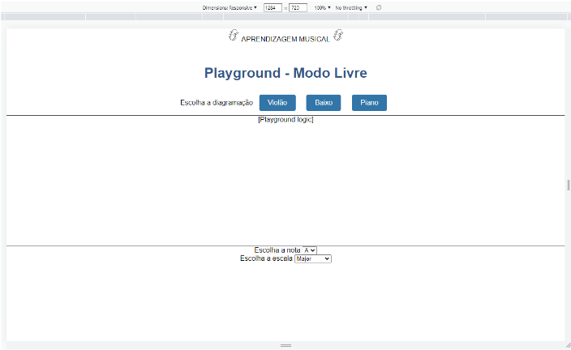
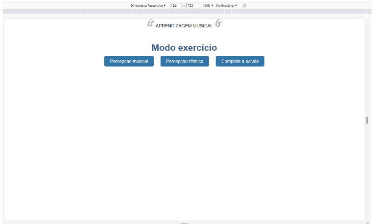
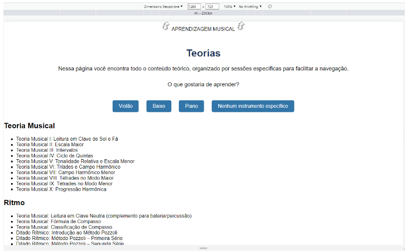

# Template padrão do site

O padrão de layout está baseado no projeto de interface, disposto conforme anexos e links, produzidos com a plataforma Miro, e seguindo também o user flow, discriminando toda a trajetória do usuário durante o uso do aplicativo.
 

Link layout:
https://miro.com/app/board/uXjVMOLyiIw=/. 
Onde é mostrado de maneira interativa para o usuário todos os possíveis caminhos, lembrando que ainda se trata de um protótipo de baixa fidelidade, e por isso pode apresentar problemas com dispositivos com telas muito grandes e/ou pequenas.
 

Inicialmente, o projeto está divido em algumas telas, essas sendo:

1. index:  
    a) playground: playground-advanced-mode e playground-freeplay-mode
         
    b) theory 
    c) exercises

## Design
A seção de Design é um dos aspectos mais importantes em um projeto de aplicativo, pois é responsável por criar a identidade visual e a experiência do usuário. Para o nosso aplicativo, optamos por um design clean e minimalista, que visa a simplicidade e a eficiência. Com isso, nossa intenção é proporcionar uma experiência fluida e agradável para o usuário, sem distrações ou elementos desnecessários que possam comprometer a usabilidade do aplicativo.

A logo central nas telas, que foi criada para ser facilmente identificável foi projetada para se adaptar facilmente a diferentes tamanhos de tela, garantindo uma aparência consistente em todas as plataformas e dispositivos.

**** Apresenta ao usuário três possíveis opções de prosseguimento no app, a partir de três botões clicáveis que o direcionam para as respectivas páginas HTML. 
* “Playground” consiste em uma área onde o usuário poderá indicar notas e escalas para que o app altere o tom em um só clique. 
* “Exercícios” apresenta alguns exercícios projetados para que o usuário agregue informações úteis ao seu rol de conhecimentos acerca da Musicologia.
* “Teorias” apresenta aspectos técnicos acerca da teoria musical.

**** Apresenta ao usuário duas possíveis opções de prosseguimento no app, a partir de dois botões clicáveis que o direcionam para as respectivas páginas HTML. 
* “Modo Livre” dá ao usuário a possibilidade de optar mais livremente entre escalas já pré-selecionadas, e que já seguem padrões criados com base na teoria musical, como por exemplo a diagramação de uma escala maior. 
* “Modo Avançado” presume um conhecimento prévio do usuário. Deixando-o livre para que possa personalizar uma escala ou acorde, de acordo com sua vontade, e ainda escolher outras cores para a melhor compreensão. Esse modo é pensado para ser usado por professores que querem mostrar aos seus alunos, de forma interativa a criação de uma escala, ou a fusão de duas ou mais escalas.

Requisitos funcionais e não-funcionais:

**** Apresenta ao usuário três possíveis opções de seleção, a partir de três botões clicáveis que alteram a diagramação demonstrada abaixo dos mesmos, visando especificar qual tipo de instrumento será utilizado na escala tonal. Na parte inferior da página existem dois campos para que o usuário opte por qual nota e escala deseja utilizar

Requisitos funcionais e não-funcionais:

**** Apresenta ao usuário três possíveis opções de seleção, a partir de três botões clicáveis que alteram o layout demonstrado abaixo dos mesmos, visando especificar qual tipo de instrumento será utilizado na escala tonal.

**** Apresenta ao usuário três possíveis opções de prosseguimento no app, a partir de três botões clicáveis que o direcionam para as respectivas páginas HTML. Cada opção o direciona para exercícios associados com as nomenclaturas da própria opção.

**** Apresenta ao usuário três possíveis opções de prosseguimento no app, a partir de três botões clicáveis que o direcionam para as respectivas páginas HTML, que por sua vez demonstram teorias específicas para o instrumento selecionado. Abaixo dos botões existem alguns textos clicáveis separados por categorias. Tais textos informam sobre o tema que será tratado em pequenos artigos escritos visando oferecer informação e aprendizado ao usuário.

> **Links Úteis**:
>
> -  [Como criar um guia de estilo de design da Web](https://edrodrigues.com.br/blog/como-criar-um-guia-de-estilo-de-design-da-web/#)
> - [CSS Website Layout (W3Schools)](https://www.w3schools.com/css/css_website_layout.asp)
> - [Website Page Layouts](http://www.cellbiol.com/bioinformatics_web_development/chapter-3-your-first-web-page-learning-html-and-css/website-page-layouts/)
> - [Perfect Liquid Layout](https://matthewjamestaylor.com/perfect-liquid-layouts)
> - [How and Why Icons Improve Your Web Design](https://usabilla.com/blog/how-and-why-icons-improve-you-web-design/)
